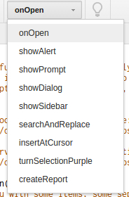

#Ejercicio 1

###### Instalar un entorno virtual para tu lenguaje de programación favorito.

Como entorno virtual he elegido [virtualenv para Python](https://virtualenv.pypa.io/en/latest/) y para su instalación emplearemos el siguiente comando:

`pip install virtualenv`

Es probable que no tengamos instalado pip, en tal caso lo instalaremos con el comando:

`sudo apt-get install python-pip`

---

#Ejercicio 2

###### Darse de alta en algún servicio PaaS tal como Heroku, Nodejitsu u OpenShift.

Me he dado de alta sin complicaciones con usuario *dvadgames@gmail.com*

---

#Ejercicio 3

###### Crear una aplicación en OpenShift y dentro de ella instalar WordPress.

Tras iniciar sesión por primera vez nos aparecerá un wizard con la opción *Create your first application now* dentro de la cual podremos buscar por nombre WordPress.

Se selecciona WordPress y tras unos minutos se creará nuestra aplicación. Para completar la instalación accederemos a la aplicación mediante la URL: [http://david-castellon.rhcloud.com/wp-admin/install.php](http://david-castellon.rhcloud.com/wp-admin/install.php)

---

#Ejercicio 4

###### Crear un script para un documento Google y cambiarle el nombre con el que aparece en el menú, así como la función a la que llama.

Para crear un script debemos entrar en algún documento que tengamos creado. Una vez dentro vamos al menú 'Tools>Script Editor...'

Cambiarle el nombre es sencillo, simplemente clicamos sobre el nombre con el que se crea por defecto y nos aparecerá una ventanita donde escribir el nuevo nombre.

Hecho ésto procedemos a seleccionar la función a la que llama en el menú superior, en este caso elegido onOpen.

---

#Ejercicio 5

###### Buscar un sistema de automatización de la construcción para el lenguaje de programación y entorno de desarrollo que usemos habitualmente.

Un sistema de automatización de la construcción para por ejemplo Python es [A-A-P](http://en.wikipedia.org/wiki/A-A-P).

Podemos acceder a una lista de software de automatización [aquí](http://en.wikipedia.org/wiki/List_of_build_automation_software).

---

#Ejercicio 6

###### dentificar, dentro del PaaS elegido o cualquier otro en el que se dé uno de alta, cuál es el fichero de automatización de construcción e indicar qué herramienta usa para la construcción y el proceso que sigue en la misma.

Mi PaaS elegido es OpenShift pero no encuentro el fichero de automatización. (Buscar de nuevo)

---

#Ejercicio 7

###### Buscar un entorno de pruebas para el lenguaje de programación y entorno de desarrollo que usemos habitualmente.

