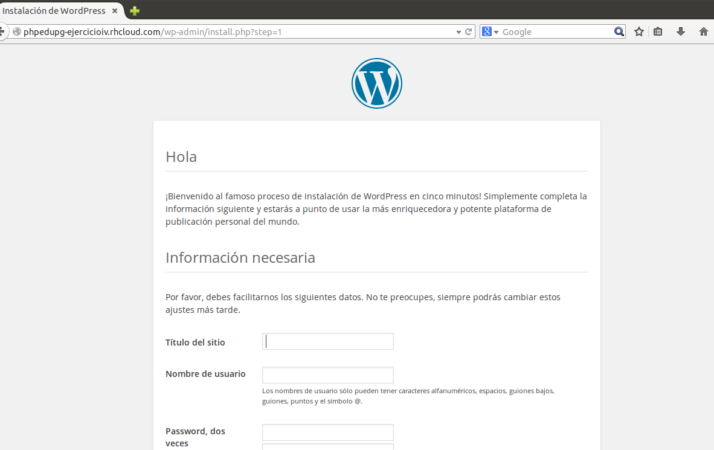
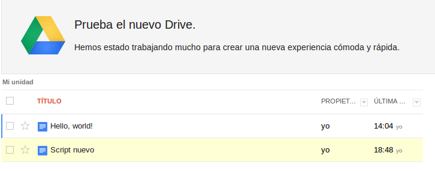

#Ejercicios tema 2 Eduardo J. Polo González.#

###Ejercicio 1:
####Instalar un entorno virtual para tu lenguaje de programación favorito (uno de los mencionados arriba, obviamente).

El entorno virtual que he elegido es virtualenv para python.

- Primero vamos a instalar pip debido a que no dispongo de el en mi ordenador:

sudo apt-get install python-pip

- Una vez finalizada la instalación de pip procedemos a instalar el entorno virtual que he elegido (en mi caso virtualenv para python).
- usamos el siguiente comando para la instalación: sudo pip install virtualenv.

- Para usarlo utilizamos el siguiente comando: virtualenv ENV

- Activamos el proyecto ENV con el siguiente comando: source bin/activate

###Ejercicio 2:
####Darse de alta en algún servicio PaaS tal como Heroku, Nodejitsu u OpenShift.

El servicio PaaS en el que me voy a dar de alta es OpenShift.

- Lo primero que voy hacer es registrarme en su [página web](https://www.openshift.com).
- Una vez que nos registramos nos saldrá el siguiente mensaje:

Para confirmar la cuenta recibiremos un email en el correo donde nos hemos registrado y desde ahí nos daremos de alta en el servicio OpenShift.

###Ejercicio 3:
####Crear una aplicación en OpenShift y dentro de ella instalar WordPress. 

-	Lo primero que tenemos que hacer es logearnos en la página.
-	Una vez logeados ya podemos crear una aplicación:

-	Escogemos instalar WordPress
-	

-	El siguiente paso es configurar la aplicación y crearla.
-	

-	Una vez creada nos muestra lo siguiente:

- Si le damos a la dirección de arriba nos muestra lo siguiente:

###Ejercicio 4:
####Crear un script para un documento Google y cambiarle el nombre con el que aparece en el menú, así como la función a la que llama. 

-Creamos el script

- Una vez creado, si lo queremos poner en marcha nos pedirá autorización

- Cuando lo abrimos muestra lo siguiente:

Script con el nombre del menú y la función cambiada.

-	Realizamos los cambios

Vemos como en el menú aparece con distinto nombre:

###Ejercicio 5:
####Buscar un sistema de automatización de la construcción para el lenguaje de programación y entorno de desarrollo que usemos habitualmente.

- El sistema de automatización de la construcción para python sería PyQGIS.

PyQGIS pertenece a la librería QGIS, tiene soporte para ejecutar scripts utilizando el lenguaje Python.

- Tenemos dos opciones para ejecutar código Python en QGIS:

   - Desde el propio QGIS podemos utilizar la consola de Python que está integrada. Para ello debemos ir a complementos > Consola de python > mostrar el editor, escribir el código y ejecutar el script.
   - Utilizar un IDE (un interprete de) como puede ser PyScripter, PyDev o Eclipse. En este caso en primer lugar debemos  importar el módulo qgis, estableciendo la ruta en la que se encuentra QGIS e iniciar la aplicación.

