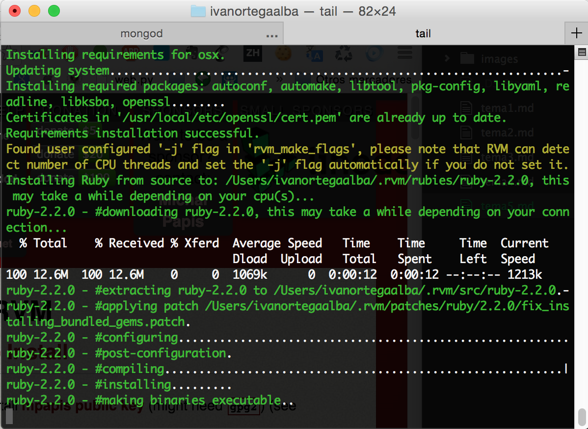

# TEMA 5: Virtualización ligera usando contenedores

## Ejercicio 1
La heramienta más popular para instalar Ruby es RVM (“Ruby Version Manager”).
Desde la [(]página oficial de Ruby](https://www.ruby-lang.org/es/downloads/) nos dan las instrucciones a seguir para instalarlo:
```
\curl -L https://get.rvm.io | bash -s stable --ruby
```
Esta herramienta nos permite instalar y controlar las distintas versiones de Ruby.

Con el anterior comando tenemos Ruby y RVM en su ultima versión estable.

Para comprobar que se ha instalado correctamente ejecutamos el comando:
```
MacBook-Pro-de-Ivan:ivanortegaalba ivanortegaalba$ ruby --version
ruby 2.0.0p481 (2014-05-08 revision 45883) [universal.x86_64-darwin14]
```
Donde podemos ver que tenemos ruby 2.0
